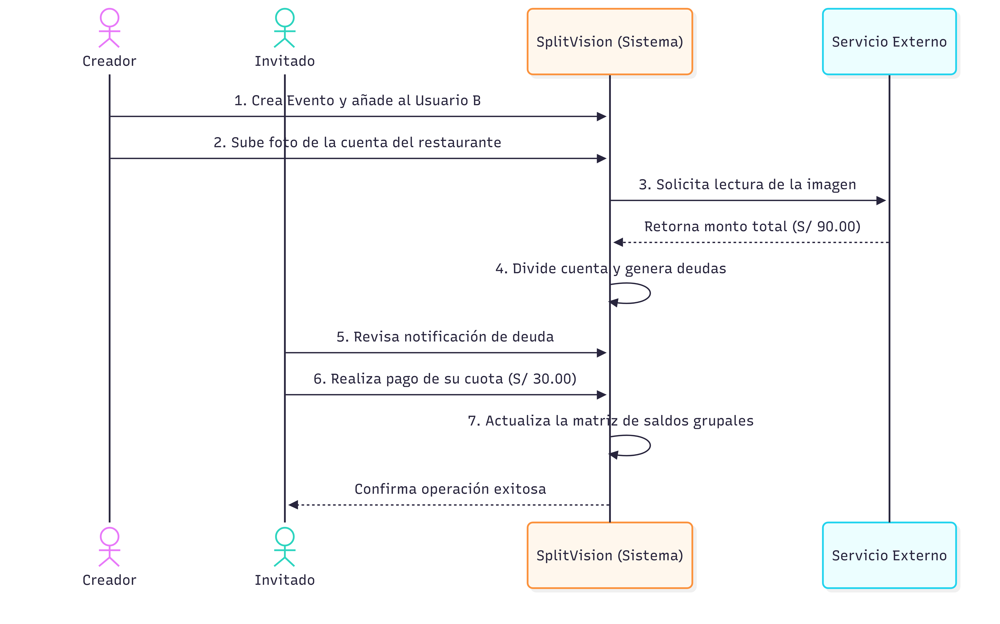

# Documento Técnico Parcial (v1.0) - SplitVision

**Curso:** Construcción de Software II (SW707)

**Equipo:**

- Gonzalo Albornoz
- Luis Angel Vargas Ponce — 20231314E
- Farid Zamudio

**Fecha:** 1 de octubre de 2026

## 1. Descripción del problema y usuarios

### 1.1. Contexto y problema del usuario

En grupos colaborativos, como compañeros de universidad, _roommates_ o grupos de viaje, la división de gastos compartidos suele realizarse de manera manual y es propensa a errores. Cuando varios integrantes asumen diferentes costos —por ejemplo, uno paga las entradas a un evento, otro la comida y otro el transporte— determinar cuánto debe pagar cada persona y quién le debe a quién puede convertirse en un proceso confuso y generar fricción entre los integrantes del grupo.

Aunque los comprobantes físicos o digitales constituyen la fuente de verdad de las transacciones, la necesidad de transcribir manualmente la información de estos comprobantes para registrar los gastos resulta ineficiente y aumenta la posibilidad de errores.

### 1.2. Problema técnico de Construcción de Software

Para automatizar este proceso, el sistema enfrenta dos retos críticos de construcción que van más allá de la implementación de un CRUD convencional:

#### A. Condiciones de carrera y concurrencia

Cuando varios usuarios de un mismo grupo intentan registrar pagos, saldar deudas o actualizar sus saldos de manera simultánea, pueden producirse **condiciones de carrera**. Por ejemplo, dos usuarios podrían intentar saldar partes de una misma cuenta al mismo tiempo, generando inconsistencias en los saldos registrados.

Si no se implementan mecanismos adecuados de control de concurrencia y bloqueo transaccional, estas operaciones simultáneas podrían comprometer la integridad de la matriz de saldos y producir resultados matemáticamente incorrectos.

Por ello, el proyecto debe contemplar un escenario de concurrencia realista y utilizar mecanismos de sincronización y transacciones que garanticen la consistencia e integridad de los datos.

#### B. Problemas de tiempo de ejecución y fallos de red

Para reducir la necesidad de transcripción manual, el sistema depende de un servicio externo de **Reconocimiento Óptico de Caracteres (OCR)** encargado de extraer información de los comprobantes.

Las llamadas a este servicio externo introducen factores que no están bajo el control directo del sistema, como **latencia impredecible, tiempos de espera (_timeouts_), errores de conexión o indisponibilidad temporal del servicio**.

Si estas situaciones no son gestionadas adecuadamente, una falla en el servicio OCR podría bloquear el procesamiento de la solicitud, afectar la experiencia del usuario e incluso provocar la pérdida o el registro incompleto de una transacción.

Por esta razón, el sistema debe incorporar mecanismos de **tolerancia a fallos**, como tiempos de espera controlados, manejo de excepciones, reintentos y estrategias de recuperación, evitando que una falla del servicio externo comprometa el funcionamiento general de la aplicación.

### 1.3. Usuarios / Actores del sistema

Usuarios Finales (Grupos Colaborativos): Personas que interactúan de forma concurrente con el sistema para cargar comprobantes, verificar extracciones automáticas y saldar deudas cruzadas.

Servicio de Extracción (API OCR): Actor de sistema externo encargado de procesar imágenes. Actúa como el principal punto de inestabilidad de red para evaluar la resiliencia de la arquitectura.

## 2. Alcance y requisitos principales

### 2.1. Delimitación del Prototipo Funcional (Alcance v1.0)

Para cumplir con el entregable del Examen Parcial, el proyecto presentará un prototipo funcional enfocado exclusivamente en la resiliencia del backend y la gestión de concurrencia en la liquidación de deudas.

- Fuera del alcance (v1.0): Pasarelas de pago reales (Visa/Mastercard), inicio de sesión con redes sociales (OAuth), exportación de reportes a PDF, notificaciones push, y despliegue final en la nube.

- Dentro del alcance (v1.0): Autenticación básica nativa, creación de eventos, carga de comprobantes, integración con un OCR, algoritmo de división de gastos, y un motor de base de datos transaccional para evitar condiciones de carrera. Las "transferencias" de dinero serán cambios de estado internos en la base de datos.

### 2.2. Modelo de Dominio y Operación (Sesiones)

Para responder a la necesidad de trazabilidad en las transacciones concurrentes, el dominio operará bajo la siguiente estructura:

#### A. Usuarios Persistentes:

Cada actor en el sistema requiere una cuenta propia (ID único, email, password) para iniciar sesión de forma independiente. No existen "sesiones grupales" ni un único usuario que anota por todos. Esta identidad persistente es el eje para aplicar bloqueos (locks) a nivel de fila en la base de datos.

#### B. Eventos (Agrupadores Temporales):

Los usuarios interactúan dentro de "Eventos" (ej. "Viaje a Cusco", "Cena de Fin de Ciclo"). El Evento es la entidad padre donde se vinculan los participantes.

#### C. Comprobantes y Extracción:

Dentro de un Evento, cualquier participante puede subir un comprobante. El sistema extrae el texto, el usuario confirma el total, y el motor genera registros en la tabla de Deudas.

#### D. Matriz de Deudas:

Es la tabla relacional donde se mapea Acreedor_ID, Deudor_ID, Monto_Total y Saldo_Pendiente. Este es el punto de contención donde el sistema demostrará su solidez técnica.

### 2.3. Flujo de Negocio

El siguiente diagrama detalla la interacción asíncrona y la resolución del escenario concurrente:

### 2.4. Explicación del Flujo principal y comportamiento del sistema

Para garantizar la comprensión del dominio de negocio y sentar las bases de la defensa técnica, se describe el ciclo de vida completo de una transacción utilizando el siguiente escenario de prueba: Los usuarios Carlos, Angel y Gonzalo comparten una salida. Carlos realiza el pago inicial de S/ 90.00 y el sistema debe gestionar la recuperación de los saldos cruzados.

#### Paso 1: Inicialización de Dominio (Creación del Evento)

- Acción del Usuario: Carlos inicializa un nuevo Evento ("Salida") y vincula a Angel y Gonzalo.

- Comportamiento del Sistema: El motor instancia una nueva entidad lógica (Evento) en la capa de persistencia. Se establecen relaciones de pertenencia entre los usuarios autenticados y este contenedor. Esta agrupación actúa como un límite de contexto, garantizando que las consultas de saldos y permisos de escritura queden aislados y protegidos únicamente para los miembros vinculados.

#### Paso 2: Recepción y Delegación Asíncrona (Carga del Comprobante)

- Acción del Usuario: Carlos carga la fotografía del comprobante por S/ 90.00 para no ingresar el gasto manualmente.

- Comportamiento del Sistema: El backend recibe el archivo y ejecuta validaciones defensivas sobre el formato y tamaño de la imagen. Para prevenir el bloqueo del hilo de ejecución web durante la comunicación con el servicio OCR externo, el sistema delega el payload a una cola de procesamiento en segundo plano. Inmediatamente, retorna un estado de "Procesamiento en curso" al cliente, manteniendo la disponibilidad y capacidad de respuesta del sistema.

#### Paso 3: Extracción, Verificación y Diseño por Contratos

- Acción del Usuario: El sistema notifica la finalización de la lectura, presenta el monto extraído (S/ 90.00) y Carlos autoriza la división en partes iguales.

- Comportamiento del Sistema: Tras la recuperación exitosa del monto por parte del Worker (procesador en segundo plano), el motor matemático entra en acción. Al dividir el gasto, el sistema aplica un contrato de diseño (Design by Contract): evalúa la invariante estricta de que la sumatoria de las fracciones de deuda generadas (Angel: S/ 30, Gonzalo: S/ 30, Carlos: S/ 30) sea exactamente equivalente al monto total bruto, mitigando riesgos de fugas por redondeo de punto flotante.

#### Paso 4: Generación de Obligaciones (Matriz de Deuda)

- Acción del Usuario: Angel y Gonzalo reciben la notificación de que mantienen un saldo pendiente de S/ 30.00 cada uno, a favor de Carlos.

- Comportamiento del Sistema: Se instancian los registros transaccionales correspondientes en la base de datos, mapeando al deudor, al acreedor y el saldo vivo. Estos registros se convierten en el recurso crítico del sistema que estará sujeto a posibles actualizaciones simultáneas.

#### Paso 5: Amortización y Control de Concurrencia (El núcleo transaccional)

- Acción del Usuario: Angel y Gonzalo deciden registrar el pago de sus respectivas cuotas.

- Comportamiento del Sistema: Al recibir una solicitud de amortización, el motor evalúa precondiciones críticas (ej. el pago debe ser mayor a cero y menor o igual al saldo actual). Si las reglas se cumplen, el sistema inicia una actualización de la matriz. Dado que ambas solicitudes pueden ingresar en el mismo milisegundo, el sistema encapsula la operación aplicando mecanismos de control de concurrencia y aislamiento transaccional a nivel de base de datos. Esto previene que una operación sobrescriba a la otra (condición de carrera), garantizando que el saldo acumulado a favor de Carlos se reduzca de forma estrictamente secuencial y segura.

#### Paso 6: Consolidación y Cierre

- Acción del Usuario: Carlos verifica el balance del Evento, el cual indica que las cuentas han sido saldadas en su totalidad.

- Comportamiento del Sistema: Las consultas de agregación suman los saldos actualizados de la matriz de deuda, confirmando que el ciclo de vida del comprobante ha finalizado sin corrupciones ni inconsistencias en la base de datos.

### 2.5. Requisitos Funcionales (v1.0)

Derivado del flujo de negocio core, el prototipo funcional a presentar en la primera etapa deberá cumplir con los siguientes requerimientos:

#### RF1: Gestión de Identidad y Trazabilidad

- Descripción: El sistema debe permitir el registro y autenticación básica de los usuarios para actuar como actores independientes y persistentes.

- Criterio de Aceptación Técnico: Toda transacción (creación de evento, carga de comprobante, pago de deuda) debe estar obligatoriamente vinculada al identificador único del usuario en sesión, garantizando la trazabilidad necesaria para las operaciones transaccionales.

#### RF2: Agrupación y Límites de Contexto (Eventos)

- Descripción: Un usuario debe poder inicializar un Evento lógico y vincular a otros usuarios registrados al mismo.

- Criterio de Aceptación Técnico: Las consultas de saldos y las operaciones de escritura deben estar estrictamente aisladas al contexto del Evento, previniendo la fuga de datos o modificaciones no autorizadas por usuarios externos a la agrupación.

#### RF3: Procesamiento Asíncrono de Extracción (Resiliencia)

- Descripción: El sistema debe permitir la recepción de imágenes de comprobantes, delegando la extracción del monto a un servicio externo (OCR) y notificando al cliente sobre el estado del proceso.

- Criterio de Aceptación Técnico (SW707): El procesamiento debe ejecutarse obligatoriamente en segundo plano. Si la integración externa experimenta latencia o falla (timeout), el sistema principal no debe bloquearse, implementando un mecanismo de tolerancia a fallas que encole o reintente la operación.

#### RF4: Motor de Fraccionamiento y Generación de Deuda (Contratos)

- Descripción: A partir de un monto bruto extraído y confirmado, el sistema debe calcular la fracción correspondiente a cada participante y generar la matriz de obligaciones cruzadas.

- Criterio de Aceptación Técnico (SW707): El algoritmo de división debe implementar programación por contratos (Design by Contract). Se debe evaluar la invariante de que la suma de las deudas fraccionadas generadas sea matemáticamente equivalente al monto bruto original antes de persistir los datos en el motor relacional.

#### RF5: Amortización y Control Transaccional (Concurrencia)

- Descripción: Los usuarios deben poder registrar pagos parciales o totales sobre las deudas activas que mantienen con otros participantes, actualizando el saldo de la matriz en tiempo real.

- Criterio de Aceptación Técnico (SW707): El sistema debe garantizar la integridad referencial y matemática bajo estrés. Si múltiples usuarios envían peticiones de pago hacia la misma matriz de manera simultánea, el sistema debe resolver la condición de carrera aplicando bloqueos transaccionales (Locks), previniendo la sobreescritura (Lost Update).

## 3. Arquitectura y decisiones técnicas

## 4. Dependencias y reúso

## 5. Problemas de runtime

## 6. Contratos y programación defensiva

### 6.1. Contratos (Design by Contract)

### 6.2. Programación Defensiva

## 7. Estrategia de errores y excepciones

## 8. Concurrencia

## 9. Tolerancia a fallas

## 10. Pruebas y resultados

## 11. Limitaciones y trabajo futuro
