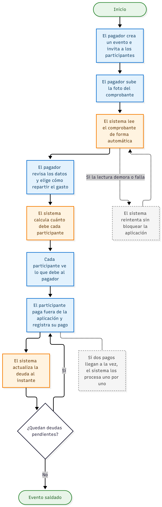
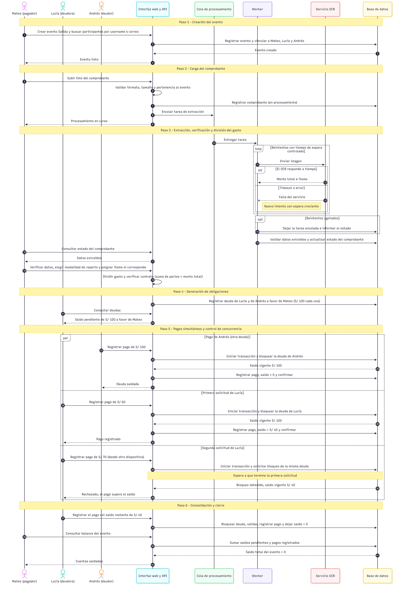

# Documento Técnico Parcial (v1.0) - SplitVision

**Curso:** Construcción de Software II (SW707)

**Equipo:**

- Gonzalo Albornoz
- Luis Angel Vargas Ponce — 20231314E
- Farid Zamudio

**Fecha:** 1 de octubre de 2026

## 1. Descripción del problema y usuarios

### 1.1. Contexto y problema del usuario

En grupos colaborativos, como compañeros de universidad, _roommates_ o grupos de viaje, la división de gastos compartidos suele realizarse de manera manual y es propensa a errores. Cuando varios integrantes asumen diferentes costos —por ejemplo, uno paga las entradas a un evento, otro la comida y otro el transporte— determinar cuánto debe pagar cada persona y quién le debe a quién puede convertirse en un proceso confuso y generar fricción entre los integrantes del grupo.

Aunque los comprobantes físicos o digitales constituyen la fuente de verdad de las transacciones, la necesidad de transcribir manualmente la información de estos comprobantes para registrar los gastos resulta ineficiente y aumenta la posibilidad de errores.

### 1.2. Problema técnico de Construcción de Software

Para automatizar este proceso, el sistema enfrenta tres retos de construcción que van más allá de la implementación de un CRUD convencional: dos retos críticos, relacionados con la concurrencia y con los fallos del servicio externo de extracción, y un reto adicional de corrección numérica en el manejo de montos de dinero.

#### A. Condiciones de carrera y concurrencia

Cada deuda se registra con un saldo pendiente (`Saldo_Pendiente`) que puede ser leído y modificado por varias solicitudes al mismo tiempo. Para ilustrar el problema, supóngase una deuda con un saldo pendiente de S/ 100 y dos solicitudes simultáneas sobre ella: un pago de S/ 60 y otro de S/ 70. Esta situación puede producirse, por ejemplo, por un doble envío del mismo formulario o por un pago y un ajuste registrados al mismo tiempo.

El problema se desarrolla de la siguiente manera:

1. Ambas solicitudes leen el saldo vigente (S/ 100).
2. Ambas verifican que el pago solicitado es menor o igual al saldo (60 ≤ 100 y 70 ≤ 100), por lo que las dos validaciones resultan exitosas.
3. La primera solicitud escribe el nuevo saldo (S/ 40).
4. La segunda solicitud, que tomó su decisión con un dato que ya quedó desactualizado, sobrescribe el saldo con su propio resultado (S/ 30).
   Como consecuencia, el sistema acepta S/ 130 en pagos sobre una deuda de S/ 100 y el saldo final no refleja las operaciones realmente realizadas. Este defecto se conoce como _Lost Update_ (actualización perdida) y se origina en un patrón de verificar y luego actuar (_check-then-act_) que no se ejecuta de forma atómica.

Si no se implementan mecanismos adecuados de control de concurrencia y bloqueo transaccional, estas operaciones simultáneas pueden vulnerar las invariantes del dominio, en particular que el saldo pendiente nunca sea negativo y que el saldo sea igual al monto total menos la suma de los pagos registrados. De este modo, la matriz de deudas produciría resultados matemáticamente incorrectos.

Por ello, el proyecto debe contemplar un escenario de concurrencia realista, que sea reproducible mediante pruebas, y utilizar mecanismos de sincronización y transacciones que garanticen la consistencia e integridad de los datos.

#### B. Fallos y resultados no confiables del servicio OCR

Para reducir la necesidad de transcripción manual, el sistema depende de un servicio externo de **Reconocimiento Óptico de Caracteres (OCR)** encargado de extraer información de los comprobantes.

Las llamadas a este servicio introducen factores que no están bajo el control directo del sistema, entre los cuales se pueden distinguir los siguientes:

- **Fallos de disponibilidad y tiempo:** latencia impredecible, tiempos de espera (_timeouts_), errores de conexión e indisponibilidad temporal del servicio.
- **Errores devueltos por el servicio:** respuestas de error del servidor (por ejemplo, códigos 5xx) o rechazos por superar el límite de uso permitido.
- **Resultados defectuosos:** respuestas incompletas o con formato inesperado, así como lecturas incorrectas, como un monto total o un ítem mal reconocido.
  Si estas situaciones no son gestionadas adecuadamente, una falla en el servicio OCR podría bloquear el procesamiento de la solicitud, afectar la experiencia del usuario e incluso provocar la pérdida o el registro incompleto de una transacción.

Adicionalmente, la estrategia de recuperación presenta su propio riesgo: un reintento mal controlado podría procesar dos veces el mismo comprobante y generar deudas duplicadas. Por esta razón, las operaciones que se reintentan deben diseñarse de modo que repetirlas no altere el resultado final.

Finalmente, la información devuelta por el OCR debe tratarse como un dato no confiable, ya que puede contener errores aun cuando la llamada sea exitosa. Por ello, el sistema debe validar su estructura y consistencia, y requerir que el usuario verifique los datos extraídos antes de generar cualquier deuda.

En consecuencia, el sistema debe incorporar mecanismos de **tolerancia a fallos**, como tiempos de espera controlados, manejo de excepciones, reintentos y estrategias de recuperación, evitando que una falla del servicio externo comprometa el funcionamiento general de la aplicación.

#### C. Precisión en el cálculo de montos

La división de un gasto no siempre produce montos exactos. Por ejemplo, al dividir S/ 100.00 entre tres participantes, cada parte equivale a S/ 33.33 y la suma de las tres deudas resulta S/ 99.99, con lo cual se pierde un centavo. Además, los tipos de dato de punto flotante, comúnmente utilizados en los lenguajes de programación, no representan con exactitud ciertos valores decimales (por ejemplo, en muchos lenguajes la suma `0.1 + 0.2` no da exactamente `0.3`), lo que puede acumular errores en operaciones con dinero.

En el reparto por ítems surge una situación similar, ya que los impuestos, la propina o los descuentos del comprobante deben distribuirse entre los participantes y la suma de los ítems rara vez coincide con el total del comprobante.

Si estos casos no se gestionan, la suma de las deudas generadas podría diferir del monto total del comprobante, incumpliendo la invariante principal del motor de división de gastos. Por ello, será necesario definir una representación exacta para los montos y una regla explícita para asignar los residuos del reparto.

#### D. Relación entre los retos y las técnicas del curso

La siguiente tabla resume cómo cada reto se vincula con las técnicas de construcción de software que se aplicarán en el proyecto:

| Reto                                     | Riesgo principal                                            | Técnica aplicada                                                      | Sección |
| ---------------------------------------- | ----------------------------------------------------------- | --------------------------------------------------------------------- | ------- |
| Concurrencia en la liquidación de deudas | Actualización perdida (_Lost Update_) y saldos incorrectos  | Control de concurrencia y bloqueos transaccionales                    | 8       |
| Fallos del servicio OCR                  | Bloqueo del sistema, pérdida o duplicación de transacciones | Procesamiento en segundo plano, _timeouts_, reintentos e idempotencia | 9       |
| Datos no confiables del OCR              | Registro de montos o ítems erróneos                         | Programación defensiva y verificación del usuario                     | 6.2     |
| Precisión en el cálculo de montos        | Suma de deudas distinta del monto total                     | Design by Contract y representación exacta de montos                  | 5 y 6.1 |

### 1.3. Usuarios / Actores del sistema

#### 1.3.1. Usuarios finales (grupos colaborativos)

Son las personas registradas en el sistema con una cuenta propia, que interactúan de forma concurrente para cargar comprobantes, verificar las extracciones automáticas y saldar deudas cruzadas. Dentro de un evento, un usuario puede desempeñar los siguientes roles:

- **Pagador (acreedor):** integrante que asumió el pago de un gasto y carga el comprobante correspondiente. Verifica los datos extraídos, selecciona la modalidad de reparto y recibe los pagos de los demás integrantes. El usuario que crea el evento y vincula a los participantes puede, o no, ser el pagador.
- **Participante (deudor):** integrante vinculado al evento que mantiene saldos pendientes a favor de otros integrantes, consulta sus deudas y registra los pagos correspondientes.
  Estos roles son contextuales y no dependen de la cuenta: un mismo usuario puede ser acreedor en un gasto y deudor en otro dentro del mismo evento, o tener roles distintos en eventos diferentes.

#### 1.3.2. Servicio de Extracción (API OCR)

Actor de sistema externo encargado de procesar las imágenes de los comprobantes. Actúa como el principal punto de inestabilidad de red, por lo que permite evaluar la resiliencia de la arquitectura.

### 1.4. Objetivo del prototipo (v1.0)

**Objetivo general:** construir un prototipo funcional de SplitVision que permita registrar gastos compartidos a partir de comprobantes registrar la liquidación de las deudas entre los integrantes de un evento, garantizando la consistencia de los saldos ante operaciones concurrentes y la continuidad del servicio ante fallas del servicio OCR.

**Objetivos específicos:**

- Garantizar la integridad de la matriz de deudas ante pagos simultáneos mediante control de concurrencia y bloqueos transaccionales.
- Mantener la disponibilidad del sistema ante latencia, errores o indisponibilidad del servicio OCR mediante procesamiento en segundo plano y mecanismos de tolerancia a fallas.
- Asegurar que la suma de las deudas generadas sea equivalente al monto total del comprobante mediante contratos de diseño (_Design by Contract_).
- Proteger el sistema frente a datos de entrada no confiables, incluidos los resultados del servicio OCR, mediante programación defensiva.

## 2. Alcance y requisitos principales

### 2.1. Delimitación del Prototipo Funcional (Alcance v1.0)

El prototipo funcional que se presentará en el Examen Parcial implementa un flujo de negocio completo, desde la creación de un evento hasta la liquidación de las deudas entre sus integrantes. Los objetivos de esta versión se describen en la sección 1.4; esta sección delimita qué funcionalidades se incluyen y cuáles quedan fuera. La versión v1.0 constituye la línea base que será evolucionada posteriormente hasta la versión final del proyecto.

**Dentro del alcance (v1.0):**

- Autenticación básica nativa mediante cuentas propias de usuario (RF1).
- Creación de eventos y vinculación de participantes registrados (RF2).
- Carga de comprobantes y extracción de su información mediante un servicio OCR, procesada en segundo plano (RF3).
- Verificación de los datos extraídos por parte del usuario y algoritmo de división de gastos, mediante reparto equitativo o reparto por ítems (RF4).
- Registro de los pagos declarados por el deudor sobre sus deudas, apoyado en un motor de base de datos transaccional para evitar condiciones de carrera (RF5).
- Consulta de deudas y del balance del evento (RF6).
- Interfaz web que permite ejecutar el flujo completo. Al tratarse de un prototipo orientado a la construcción del software, su diseño visual se mantiene simple.

**Fuera del alcance (v1.0):**

- Pasarelas de pago reales (Visa/Mastercard) e integración con billeteras digitales o entidades bancarias. El sistema no mueve ni custodia dinero.
- Verificación del pago por parte del acreedor y validación de la operación real. El pago se realiza fuera del sistema (efectivo, billetera digital o transferencia bancaria) y el deudor lo registra en la aplicación, la cual actualiza el saldo sin verificar la operación real.
- Inicio de sesión con redes sociales (OAuth).
- Exportación de reportes a PDF.
- Notificaciones push. El usuario conocerá el estado de las operaciones consultándolo desde la interfaz web.
- Aplicación móvil nativa.
- Despliegue final en la nube.

### 2.2. Modelo de Dominio y Operación (Sesiones)

Para responder a la necesidad de trazabilidad en las transacciones concurrentes, el dominio operará bajo la siguiente estructura:

#### A. Usuarios Persistentes:

Cada actor en el sistema requiere una cuenta propia (ID único, username, email y contraseña) para iniciar sesión de forma independiente. El username y el correo electrónico deben ser únicos dentro del sistema, ya que permiten identificar y buscar usuarios para vincularlos a eventos. Las contraseñas no se almacenan en texto plano.

No existen "sesiones grupales" ni un único usuario que anota por todos. Esta identidad persistente permite vincular cada operación con el usuario que la realizó, lo que garantiza la trazabilidad de las transacciones.

#### B. Eventos (Agrupadores Temporales):

Los usuarios interactúan dentro de "Eventos" (ej. "Viaje a Cusco", "Cena de Fin de Ciclo"). El Evento es la entidad padre donde se vinculan los participantes y que delimita el contexto de los gastos, las deudas y los permisos.

#### C. Comprobantes y Extracción:

El sistema extrae la información del comprobante y el usuario verifica los datos obtenidos. El gasto podrá dividirse mediante reparto equitativo entre los participantes o mediante reparto por ítems, asignando los ítems consumidos a cada participante.

#### D. Matriz de Deudas:

Es la tabla relacional donde se registran las obligaciones entre los participantes de un evento. Cada deuda se identifica por el evento y el comprobante de origen, el acreedor (`Acreedor_ID`), el deudor (`Deudor_ID`), el monto total (`Monto_Total`) y el saldo pendiente (`Saldo_Pendiente`). Cada pago realizado sobre una deuda se registra de forma independiente y vinculado al usuario que lo efectuó. En esta versión, el pago es declarado: el deudor lo realiza fuera del sistema y lo registra en la aplicación, y el sistema actualiza el saldo sin verificar la operación real. Esta tabla es el punto de contención donde el sistema demostrará su solidez técnica.

#### E. Entidades principales e invariantes

La siguiente tabla resume las entidades del dominio. El modelo de datos detallado se presenta en la sección 3.

| Entidad       | Descripción                                                     | Atributos principales                                                               |
| ------------- | --------------------------------------------------------------- | ----------------------------------------------------------------------------------- |
| Usuario       | Persona registrada en el sistema                                | ID, username, email, contraseña (cifrada)                                           |
| Evento        | Agrupador de participantes, gastos y deudas                     | ID, nombre, creador                                                                 |
| Participación | Vínculo entre un usuario y un evento                            | Evento_ID, Usuario_ID                                                               |
| Comprobante   | Gasto pagado por un participante                                | ID, Evento_ID, pagador, monto total, estado                                         |
| Ítem          | Línea del comprobante, con los participantes que lo consumieron | ID, Comprobante_ID, descripción, monto                                              |
| Deuda         | Obligación de un deudor hacia un acreedor                       | ID, Evento_ID, Comprobante_ID, Acreedor_ID, Deudor_ID, Monto_Total, Saldo_Pendiente |
| Pago          | Amortización registrada sobre una deuda                         | ID, Deuda_ID, Usuario_ID, monto, fecha                                              |

Las reglas que el sistema debe mantener siempre (invariantes del dominio) son:

1. El saldo pendiente de una deuda nunca es negativo ni mayor que su monto total.
2. El saldo pendiente es igual al monto total de la deuda menos la suma de los pagos registrados sobre ella.
3. La suma de las partes asignadas a todos los participantes de un comprobante es igual al monto total del comprobante.

### 2.3. Flujo de Negocio

El siguiente diagrama de secuencia detalla la interacción asíncrona y la resolución del escenario concurrente. Corresponde a los seis pasos descritos en la sección 2.4.

#### Diagrama de Flujo del negocio Simplificado

#### Diagrama de Flujo del negocio Detallado

### 2.4. Explicación del Flujo principal y comportamiento del sistema

Para facilitar la comprensión del dominio de negocio, se describe el ciclo de vida completo de una transacción mediante el siguiente escenario: los usuarios Mateo, Lucía y Andrés comparten una salida. Mateo realiza el pago inicial de la cuenta y el sistema debe gestionar la recuperación de los saldos entre ellos.

#### Paso 1: Inicialización de Dominio (Creación del Evento)

- **Acción del usuario:** Mateo inicializa un nuevo Evento ("Salida"), queda vinculado a él como primer participante y busca a Lucía y Andrés, que ya están registrados, mediante su username o correo electrónico para vincularlos al Evento.
- **Comportamiento del sistema:** el sistema crea una nueva entidad lógica (Evento) en la capa de persistencia y establece las relaciones de pertenencia entre los usuarios autenticados y este contenedor. Esta agrupación actúa como un límite de contexto: las consultas de saldos y los permisos de escritura quedan aislados y protegidos únicamente para los miembros vinculados.

#### Paso 2: Recepción y Delegación Asíncrona (Carga del Comprobante)

- **Acción del usuario:** Mateo carga la fotografía del comprobante para no ingresar el gasto manualmente.
- **Comportamiento del sistema:** el backend recibe el archivo y ejecuta validaciones defensivas sobre el formato y el tamaño de la imagen, además de verificar que el usuario pertenezca al evento. Para evitar el bloqueo del hilo de ejecución web durante la comunicación con el servicio OCR externo, el sistema delega el procesamiento a una cola en segundo plano. De inmediato retorna al cliente el estado "Procesamiento en curso", con lo cual mantiene su disponibilidad y capacidad de respuesta.

#### Paso 3: Extracción, Verificación y Diseño por Contratos

- **Acción del usuario:** al finalizar la lectura, el estado del comprobante se actualiza y Mateo puede consultar la información extraída. Mateo verifica los datos (y los corrige si es necesario) y selecciona una modalidad de división: reparto equitativo o reparto por ítems. En el reparto por ítems, además, asigna los ítems a los participantes que los consumieron.
- **Comportamiento del sistema:** el Worker (procesador en segundo plano) invoca al servicio OCR aplicando los mecanismos de tolerancia a fallas descritos en la sección 9 (tiempos de espera, reintentos o encolamiento), de modo que una falla del servicio no afecte al sistema principal. Si los reintentos se agotan, la tarea permanece encolada y el estado del comprobante informa la situación al usuario. La información recuperada se trata como un dato no confiable y se valida antes de presentarla al usuario. Una vez que Mateo confirma los datos y la modalidad, el motor de cálculo divide el gasto. En el reparto equitativo, el monto total se distribuye entre todos los participantes; en el reparto por ítems, la parte de cada participante se calcula según los ítems que tiene asignados. En ambos casos se aplica la regla definida para asignar los residuos de redondeo y se verifica, mediante un contrato de diseño (_Design by Contract_), que la suma de las partes asignadas sea equivalente al monto total del comprobante antes de persistir los datos.

#### Paso 4: Generación de Obligaciones (Matriz de Deuda)

- **Acción del usuario:** Lucía y Andrés pueden consultar en el sistema que mantienen un saldo pendiente, correspondiente a su parte del gasto, a favor de Mateo. Por ejemplo, si el comprobante es de S/ 300 y se reparte de forma equitativa, cada uno debe S/ 100.
- **Comportamiento del sistema:** se registran las deudas correspondientes en la base de datos, indicando el deudor, el acreedor y el saldo pendiente. Solo se generan deudas para los participantes distintos del pagador: la parte de Mateo no genera ninguna deuda, ya que él mismo pagó el gasto. Estos registros se convierten en el recurso crítico del sistema, sujeto a posibles actualizaciones simultáneas.

#### Paso 5: Amortización y Control de Concurrencia (El núcleo transaccional)

- **Acción del usuario:** Andrés registra en el sistema el pago de su deuda de S/ 100, que realizó previamente fuera de la aplicación (por ejemplo, mediante una billetera digital). Casi al mismo tiempo, Lucía envía dos solicitudes de registro de pago sobre su propia deuda, una de S/ 60 y otra de S/ 70, por ejemplo al registrar un mismo pago desde dos dispositivos distintos con montos diferentes.
- **Comportamiento del sistema:** cada solicitud de amortización se ejecuta dentro de su propia transacción. Antes de evaluar las precondiciones, el sistema bloquea el registro de la deuda correspondiente, de modo que la otra solicitud espera a que la primera termine. Con el saldo vigente ya protegido, se evalúan las precondiciones críticas: el pago debe ser mayor a cero y menor o igual al saldo actual. Si se procesa primero el pago de S/ 60, el saldo pasa de S/ 100 a S/ 40 y el pago queda registrado con el usuario que lo efectuó. Al ejecutarse después, el pago de S/ 70 se evalúa contra el saldo de S/ 40, incumple la precondición y es rechazado con un error controlado, sin modificar el saldo. De este modo se evita que una operación sobrescriba a la otra (condición de carrera y _Lost Update_, descritos en la sección 1.2.A). El pago de Andrés afecta a una deuda distinta y se procesa sin verse bloqueado por las solicitudes de Lucía.

#### Paso 6: Consolidación y Cierre

- **Acción del usuario:** Lucía, informada de que su saldo vigente es de S/ 40, registra el pago restante. Mateo verifica el balance del Evento, el cual indica que las cuentas han sido saldadas en su totalidad.
- **Comportamiento del sistema:** las consultas de agregación suman los saldos pendientes y los pagos registrados de la matriz de deudas. Con ello se confirma que el saldo total es cero y que, para cada deuda, los pagos más el saldo pendiente equivalen al monto total, es decir, que el ciclo de vida del comprobante finalizó sin corrupciones ni inconsistencias en la base de datos.

### 2.5. Requisitos Funcionales (v1.0)

Derivado del flujo de negocio core, el prototipo funcional a presentar en la primera etapa deberá cumplir con los siguientes requerimientos:

#### RF1: Gestión de identidad y trazabilidad

- **Descripción:** el sistema debe permitir el registro y la autenticación básica de los usuarios para actuar como actores independientes y persistentes. Durante el registro, el usuario debe establecer un username único y un correo electrónico único que permitan su identificación y búsqueda dentro del sistema.
- **Criterio de aceptación técnico:** toda transacción (creación de evento, carga de comprobante, pago de deuda) debe estar obligatoriamente vinculada al identificador único del usuario en sesión, garantizando la trazabilidad necesaria para las operaciones transaccionales. El sistema debe rechazar registros con username o correo duplicados y no debe almacenar contraseñas en texto plano.

#### RF2: Agrupación y límites de contexto (eventos)

- **Descripción:** un usuario debe poder inicializar un Evento lógico y vincular a otros usuarios registrados mediante la búsqueda por username o correo electrónico.
- **Criterio de aceptación técnico:** las consultas de saldos y las operaciones de escritura deben estar estrictamente aisladas al contexto del Evento. Toda operación realizada por un usuario que no pertenezca al evento debe ser rechazada, previniendo la fuga de datos o modificaciones no autorizadas.

#### RF3: Procesamiento asíncrono de extracción (resiliencia)

- **Descripción:** el sistema debe permitir la recepción de imágenes de comprobantes y delegar a un servicio externo (OCR) la extracción de su información relevante, incluyendo el monto total y los ítems cuando estén disponibles. Asimismo, debe informar al cliente sobre el estado del proceso.
- **Criterio de aceptación técnico (SW707):** el procesamiento debe ejecutarse obligatoriamente en segundo plano. Si la integración externa experimenta latencia o falla (_timeout_), el sistema principal no debe bloquearse e implementará un mecanismo de tolerancia a fallas que encole o reintente la operación. Un reintento no debe producir el procesamiento duplicado de un mismo comprobante.

#### RF4: Motor de fraccionamiento y generación de deuda (contratos)

- **Descripción:** a partir del monto total del comprobante, verificado por el usuario, el sistema calcula la parte que corresponde a cada participante según la modalidad de reparto seleccionada: reparto equitativo o reparto por ítems. En el reparto equitativo, el monto se divide entre los participantes; en el reparto por ítems, la parte de cada participante se determina según los ítems que tenga asignados. Las deudas se generan a favor del pagador para los participantes distintos de él.
- **Criterio de aceptación técnico (SW707):** el algoritmo de división debe implementar programación por contratos (_Design by Contract_). Se debe evaluar la invariante de que la suma de las partes asignadas a todos los participantes (incluido el pagador) sea matemáticamente equivalente al monto total del comprobante antes de persistir los datos en el motor relacional.

#### RF5: Amortización y control transaccional (concurrencia)

- **Descripción:** los usuarios deben poder registrar pagos parciales o totales sobre las deudas activas que mantienen con otros participantes, actualizando el saldo pendiente en tiempo real. El pago es declarado: el deudor lo realiza fuera del sistema (efectivo, billetera digital, transferencia bancaria u otro medio) y lo registra en la aplicación indicando el monto, el método utilizado y, de forma opcional, una referencia de la operación. Cada pago queda registrado con el usuario que lo efectuó.
- **Criterio de aceptación técnico (SW707):** el sistema debe garantizar la integridad referencial y matemática bajo estrés. Si múltiples solicitudes de pago llegan de manera simultánea sobre la misma deuda, el sistema debe resolver la condición de carrera aplicando bloqueos transaccionales (_locks_), previniendo la sobreescritura (_Lost Update_). Las precondiciones del pago (monto mayor a cero y menor o igual al saldo vigente) deben evaluarse una vez obtenido el bloqueo, y las solicitudes que las incumplan deben rechazarse sin alterar el saldo. El método de pago debe pertenecer a una lista cerrada de opciones y la referencia, al ser un texto ingresado por el usuario, debe validarse antes de almacenarse.

#### RF6: Consulta de deudas y balance del evento

- **Descripción:** los participantes de un evento deben poder consultar sus deudas, sus pagos y el balance general del evento.
- **Criterio de aceptación técnico:** los saldos mostrados deben ser consistentes con la matriz de deudas: para cada deuda, los pagos registrados más el saldo pendiente deben equivaler al monto total. La consulta solo debe estar disponible para los miembros del evento.

#### Trazabilidad entre requisitos y técnicas del curso

| Requisito | Técnica principal                                     | Sección |
| --------- | ----------------------------------------------------- | ------- |
| RF1       | Programación defensiva, manejo de errores             | 6.2, 7  |
| RF2       | Programación defensiva (autorización por evento)      | 6.2     |
| RF3       | Tolerancia a fallas, análisis de problemas de runtime | 5, 9    |
| RF4       | _Design by Contract_                                  | 5, 6.1  |
| RF5       | Concurrencia y control transaccional                  | 8       |
| RF6       | _Design by Contract_ (invariantes), pruebas           | 6.1, 10 |

### 2.6. Requisitos no funcionales (v1.0)

- **RNF1. Consistencia e integridad:** los saldos deben cumplir las invariantes del dominio (sección 2.2.E) aun bajo operaciones concurrentes.
- **RNF2. Disponibilidad ante fallas externas:** el sistema debe responder a las solicitudes de los usuarios sin esperar al servicio OCR, y una falla de este servicio no debe afectar al resto de las operaciones.
- **RNF3. Seguridad básica:** las contraseñas deben almacenarse de forma cifrada y cada operación debe validar la pertenencia del usuario al evento.
- **RNF4. Trazabilidad:** toda operación relevante debe registrarse con el usuario que la realizó y dejar evidencia en los registros (_logs_) del sistema.
- **RNF5. Verificabilidad:** los escenarios críticos, en especial el escenario concurrente, deben poder reproducirse mediante pruebas automatizadas.

## 3. Arquitectura y decisiones técnicas

## 4. Dependencias y reúso

## 5. Problemas de runtime

## 6. Contratos y programación defensiva

### 6.1. Contratos (Design by Contract)

### 6.2. Programación Defensiva

## 7. Estrategia de errores y excepciones

## 8. Concurrencia

## 9. Tolerancia a fallas

## 10. Pruebas y resultados

## 11. Limitaciones y trabajo futuro
